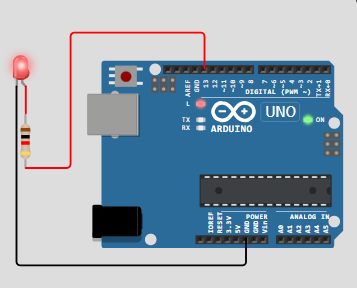

# LED Blinking Arduino Programming
---
```C
void setup()
{
    //set wether pin13 is input or output
    pinMode(13, OUTPUT); 
}

void loop()
{
    //turn on the led
    digitalWrite(13, HIGH); //bumpy font as W is cap
    //wait for 1 second
    delay(1000); 
    //turn off the led
    digitalWrite(13, LOW); 
    //wait for 1 second
}
``` 
### Circuit Diagram
---
Turns on LED for 1 second and then turn off for another 1 second. The loop continuous since main code is written inside of void loop function.
                      

[Click Here](https://wokwi.com/projects/396771199587011585) for WOKWI Simulation circuit.
